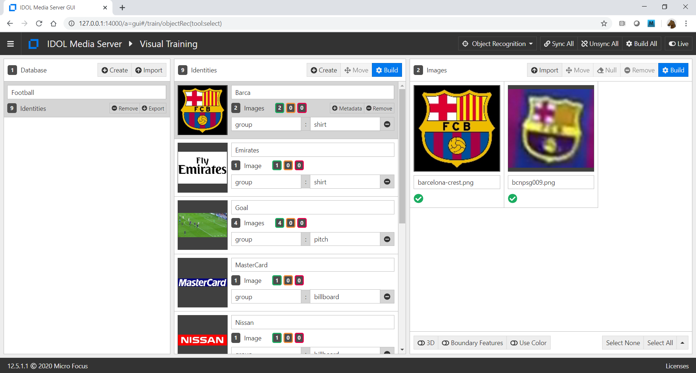
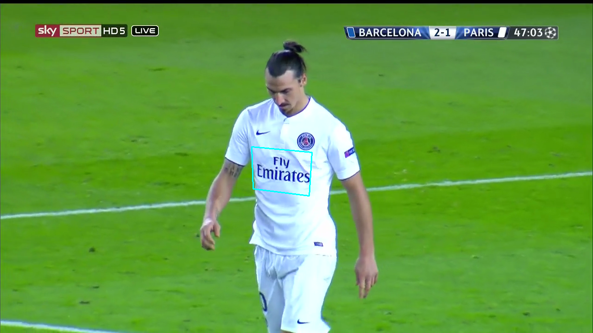

# Logo Recognition

Media Server includes an Object Recognition analysis engine, which can be trained to recognize specific 2-D and 3-D objects in images and video, such as a logo or painting.

For a more detailed introduction to Object Recognition, see the [admin guide](https://www.microfocus.com/documentation/idol/IDOL_12_8/MediaServer_12.8_Documentation/Guides/html/English/index.html#Operations/Analyze/ObjectRecognition_Introduction.htm).

We will:

1. use the Object Recognition analysis engine to train Objects and identify them in a video from a football match
1. use transform and image encoding engines to save cropped images of the Objects we find

This guide assumes you have already completed the [introductory tutorial](../../README.md#introduction).

<!-- TOC depthFrom:2 -->

- [Setup](#setup)
  - [Third-party software](#third-party-software)
  - [Configure object recognition](#configure-object-recognition)
    - [Enabled modules](#enabled-modules)
    - [Licensed channels](#licensed-channels)
- [Training objects](#training-objects)
- [Process configuration](#process-configuration)
  - [Video file ingest](#video-file-ingest)
  - [Analysis](#analysis)
  - [Event processing](#event-processing)
  - [Encoding images as output](#encoding-images-as-output)
  - [In-use tracks](#in-use-tracks)
- [Running our analysis](#running-our-analysis)
- [Next steps](#next-steps)

<!-- /TOC -->

## Setup

### Third-party software

This guide makes use of `node.js`.  Please follow these [instructions](../setup/NODE_JS.md) if you do not already have it on your system.

### Configure object recognition

Media Server must be licensed for visual analytics, as described in the [introductory tutorial](../../introduction/PART_I.md#enabling-analytics).  To reconfigure Media Server you must edit your `mediaserver.cfg` file.

#### Enabled modules

The `Modules` section is where we list the engines that will be available to Media Server on startup.  Ensure that this list contains the module `objectrecognition`:

```ini
[Modules]
Enable=...,objectrecognition,...
```

#### Licensed channels

The `Channels` section is where we instruct Media Server to request license seats from License Server.  To enable *Object Recognition* for this tutorial, you need to enable at least one channel of type *Visual*:

```ini
[Channels]
...
VisualChannels=1
```

> For any changes you make in `mediaserver.cfg` to take effect you must restart Media Server.

## Training objects

We previously trained faces by manually importing them into the training web app at [`/action=gui`](http://127.0.0.1:14000/a=graphicaluserinterface).  It is sometimes preferable to make use of the training actions programmatically, *i.e.* if we have many identities to train, or we just wish to automate the process.

Let's use the included `trainObjects.js` script to create identities for the Objects saved in our `billboard` and `shirt` directories by running the command in your terminal:

```bsh
node trainObjects.js
```

We can then view the trained Objects in the training web app [`/action=gui`](http://127.0.0.1:14000/a=gui#/train/objectRec(tool:select)).



Alternatively you can list the trained models by pointing your browser to [`/action=listObjects`](http://127.0.0.1:14000/a=listObjects&Database=Football).

Name | Type | Object images
:---: | :---: | :---:
MasterCard | Billboard | 
Nissan | Billboard | 
PlayStation | Billboard | 
Unicredit | Billboard | 
PSG | Shirt | 
Emirates | Shirt | 
Barcelona | Shirt | 
Qatar Airways | Shirt | 

These objects are all 2D, *i.e.* flat images that might be seen from different angles but will always be flat when seen.  These objects can be trained with one or more images.  

> Training additional images for 2D objects is advisable.  A match to the object results from a match to any of its trained images.

3D objects can also be trained; however, because a 3D object can look significantly different from different angles, multiple images from multiple angles are always required to train such an object.

## Process configuration

### Video file ingest

To ingest a video file, we will include the following in our process configuration:

```ini
[Session]
Engine0 = VideoIngest
# Process every frame in the video irrespective of time taken
IngestRate = 0

[VideoIngest]
Type = Video
# Use video time rather than clock time
IngestDateTime = 0
```

For full details on the options available for ingesting video (and other) sources, please read the [reference guide](https://www.microfocus.com/documentation/idol/IDOL_12_8/MediaServer_12.8_Documentation/Help/index.html#Configuration/Ingest/_Ingest.htm).

### Analysis

To detect objects, we need to include the following:

```ini
[ObjectRecognition]
Type = ObjectRecognition
NumParallel = 2
Database = Football
ColorAnalysis = True
ObjectEnvironment = Cluttered
```

Here we have specified our newly created database with the `Database` parameter.  Without doing this, the analysis engine would attempt to match against all available object recognition databases.  Additional restrictions can be placed by providing:

- an identifier (or list of identifiers), *e.g.* for one-to-one validation (or matching a sub-set)
- a metadata key-value pair, *e.g.* if you want to match only shirt sponsors in our example, set `Metadata = group:shirt`

We have also specified some parameters that affect how the analytic runs.  For full details on these and other available options, please read the [reference guide](https://www.microfocus.com/documentation/idol/IDOL_12_8/MediaServer_12.8_Documentation/Help/index.html#Configuration/Analysis/Object/_Object.htm).

### Event processing

We will use an event processing filter to select high quality matches of a reasonable minimum size.  We will use a Lua function to filter on both the confidence of the match and the dimensions of the recognized object.

```ini
[HighQualityObjects]
Type = Filter
Input = ObjectRecognition.ResultWithSource
LuaLine = function pred(x) return x.IdentityData.confidence > 50 and x.RegionData.width > 20 and x.RegionData.height > 20 end
```

*N.B.* In production it is recommended to reference a script file, e.g. using the logo filter:

```ini
LuaScript = mmap/logoConfidenceFilter.lua
```

For more information on working with Lua scripts, see this short [guide](../../appendix/Lua_tips.md).

### Encoding images as output

Next we will draw overlays and then crop images around the detected objects before encoding them to files on disk:

```ini
# Transform
[DrawPolygon]
Type = Draw
Input = HighQualityObjects.Output
Color = Aqua
Thickness = 3

[CropObjects]
Type = Crop
Input = HighQualityObjects.Output
Border = 15
BorderUnit = Percent

# Encoding
[SaveFullImage]
Type = ImageEncoder
ImageInput = DrawPolygon.Output
OutputPath = output/football/%record.IdentityData.identifier%_%record.IdentityData.confidence%_%record.peakTime.timestamp%.png

[SaveCroppedImage]
Type = ImageEncoder
ImageInput = CropObjects.Output
OutputPath = output/football/%record.IdentityData.identifier%_%record.IdentityData.confidence%_%record.peakTime.timestamp%_crop.png
```

> Unlike in the [introductory tutorial](../../introduction/PART_II.md#transformation-and-encoding), where used `draw.lua` to define out bound box color and line thickness, here were are specifying them directly.

### In-use tracks

Remember that only connected tracks are populated as a Media Server process runs.  If you want to view some additional tracks, *e.g.* in Activity, you can add them as inputs to a "dummy" engine, for example in this *Combine*-type event processing engine:

```ini
[Keep]
Type = Combine
Input0 = ObjectRecognition.DataWithSource
Input1 = ObjectRecognition.Start
Input2 = ObjectRecognition.End
```

## Running our analysis

Use the included sample video `bcnpsg.mp4`. Copy it under `C:\MicroFocus\video`.

While testing, or if you simply wish to keep your config files in a project-specific directory outside of `configurations`, you can reference a config file path in the process action by setting the `configPath` parameter (assuming of course that Media Server can access the location where your process configuration file is stored).

Let's try it. Paste the following parameters into [`test-action`](http://127.0.0.1:14000/a=admin#page/console/test-action), remembering to update the `source` and `configPath` parameters to match your setup:

```url
action=process&source=C:/MicroFocus/video/bcnpsg.mp4&configPath=C:/MicroFocus/idol-rich-media-tutorials/tutorials/showcase/logo-recognition/objectRecognition.cfg
```

Click `Test Action` to start processing.

To review the resulting detection images, go to `output/football`, *e.g.*



Stop processing with [`stop`](http://127.0.0.1:14000/a=queueInfo&queueAction=stop&queueName=process) or just let the process stop itself when it reaches the end of the video file.

## Next steps

Why not try more tutorials to explore some of the other analytics available in Media Server, linked from the [main page](../../README.md).
